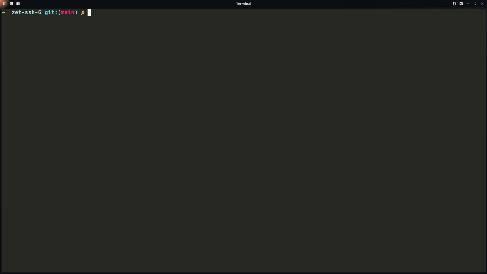
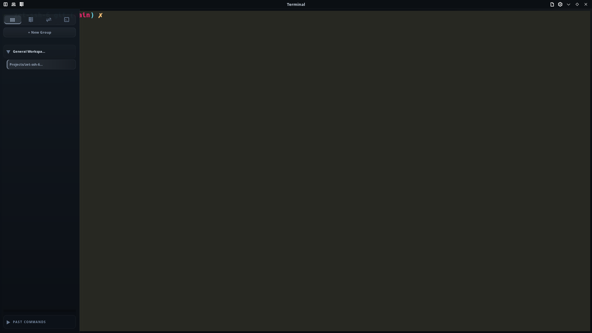
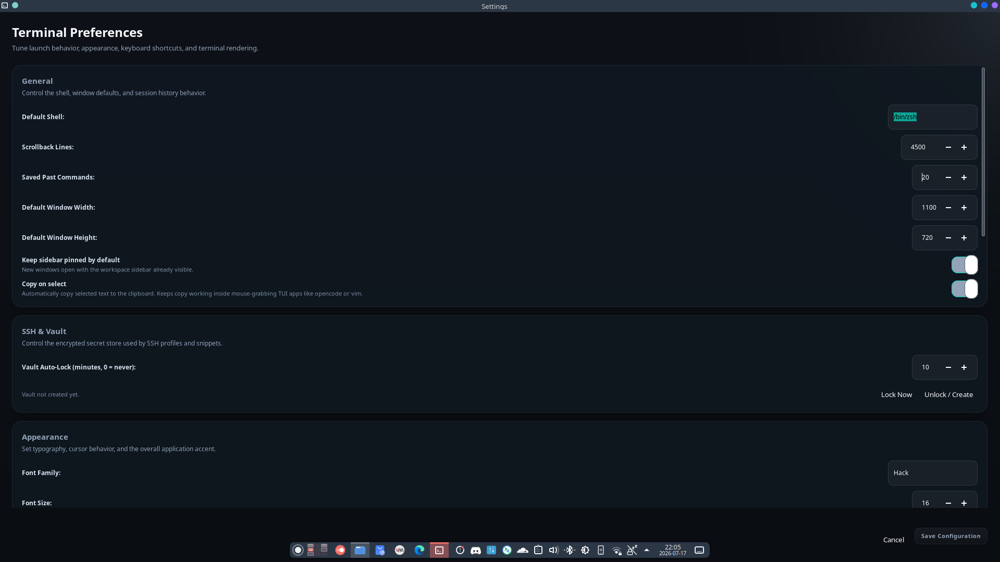

# Zet-SSH

Zet-SSH is a modern GTK4 + VTE terminal and SSH manager for Linux. It turns
"SSH into servers" into a clean, repeatable, auditable workflow — every action
shows the exact `ssh` / `scp` / `sftp` command behind it.

It stays zen by default: a minimal, distraction-free terminal. All the SSH
tooling lives one keystroke or one hover away.

## Showcase

### Clean terminal



### Workspace sidebar



### Terminal preferences



## Features

**Terminal**
- Fast GTK4 + VTE terminal with tabs, tab groups, and pinning
- Multi-window workflow with synced workspace state
- Copy-on-select and a right-click Copy/Paste menu that never steals input
  from mouse-driven TUI apps (opencode, vim, htop, tmux)
- Theme accents, terminal palette presets, cursor and font controls
- Configurable keyboard shortcuts for everything

**SSH manager** (sidebar sections: Tabs · Hosts · Tunnels · Snippets)
- **Hosts** — saved connection profiles (host, port, user, auth, ProxyJump,
  known-hosts policy, keepalive, remote dir, ciphers/KEX, tags). Connect in one
  click; paste an `ssh …` command and save it as a profile from the right-click
  menu.
- **Encrypted vault** — passwords, key passphrases, and snippet variables are
  stored in `vault.zet`, encrypted with XChaCha20-Poly1305 and an Argon2id-derived
  key. Fast unlock, configurable auto-lock timer, lock-now shortcut.
- **Tunnels** — local (`-L`), remote (`-R`), and dynamic SOCKS (`-D`) port
  forwards per profile, started/stopped in the background with live status.
- **Command library** — reusable snippets with `${VAR}` placeholders, filled
  interactively or from the vault, then inserted or run in the active terminal.
- **Remote file browser** — browse a host over a shared SSH ControlMaster
  connection; download/upload with `scp`; jump to an interactive `sftp` session.
- **Command log** — every generated command is recorded and copyable, so you can
  learn and audit exactly what ran.
- **Quick Connect palette** — fuzzy search across hosts, tunnels, snippets, and
  actions (default `Ctrl+Shift+K`).

## Keyboard shortcuts (defaults)

| Action           | Shortcut          |
|------------------|-------------------|
| New tab          | `Ctrl+T`          |
| New window       | `Ctrl+Shift+N`    |
| Close tab        | `Ctrl+Shift+W`    |
| Next / Prev tab  | `Ctrl+PgDn` / `PgUp` |
| Copy / Paste     | `Ctrl+Shift+C` / `Ctrl+Shift+V` |
| Toggle sidebar   | `Ctrl+B`          |
| Quick Connect    | `Ctrl+Shift+K`    |
| Command Log      | `Ctrl+Shift+L`    |
| Lock Vault       | `Ctrl+Shift+X`    |

All shortcuts are editable in Settings.

## Build

Requirements: Go, GTK4, VTE for GTK4. Optional: `sshpass` (only needed to
auto-authenticate password-based hosts for background actions like tunnels and
the remote file browser; agent/key auth needs nothing extra).

```bash
make build
./bin/zet-terminal
```

## Install

```bash
make install
```

## Configuration

Zet-SSH stores everything locally under `~/.config/zet-terminal/`:

```text
config.json     app settings, tabs, shortcuts
profiles.json   saved SSH hosts
tunnels.json    saved tunnels
snippets.json   command library
vault.zet       encrypted secrets (Argon2id + XChaCha20-Poly1305)
```

Most settings are managed from the in-app preferences window. The vault is
never written in plaintext, and its master password cannot be recovered if lost.
